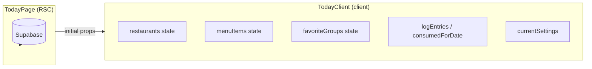
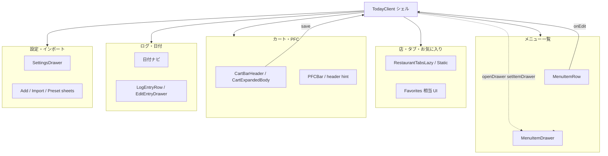

# TodayClient 状態フロー設計（Issue #213 Ph-2 前）

本書は [`issue-213-refactor-codebase.md`](./issue-213-refactor-codebase.md) の **Ph-2 設計** に沿い、`TodayClient.tsx` に集中しているクライアント状態の所有者・移管方針・props の流れを整理する。ここで合意したうえで **Ph-2a**（コンポーネント分割）に着手する。

**正の実装**: 現行コードは `src/app/today/TodayClient.tsx` および `src/app/today/page.tsx`。本書と実装が食い違う場合は実装を正とし、本書を追随させる。

---

## 1. スコープ

| 含む | 含まない |
|------|----------|
| ルート `TodayClient` の `useState` / 関連 `useRef` | Server Actions の入出力仕様（別ドキュメント・コードを正） |
| 同一ファイル内に定義されているサブコンポーネントのローカル `useState`（一覧レベル） | `StandardFoodPanel` / `RestaurantTabsLazy` など **別ファイル** の内部 state（各ファイルを正） |
| Ph-2 分割時の推奨オーナー（hook / コンポーネント） | 実際のファイル名変更の細部（Ph-2a〜2d の PR で確定） |

---

## 2. サーバーからのデータ入口（RSC → Client）

`TodayPage`（RSC）が取得したデータは、いったん **ルート `TodayClient` の props** として渡され、対応する `useState(initial…)` で **クライアント上の可変コピー** になる。



| Prop | 初期 state | 備考 |
|------|-------------|------|
| `restaurants` | `restaurants` | 並び替え・追加・削除・リネームで更新 |
| `menuItems` | `menuItems` | 追加・編集・削除・インポートで更新 |
| `initialFavoriteGroups` | `favoriteGroups` | お気に入りトグル・店名変更連動で更新 |
| `settings` | `currentSettings` | 設定ドロワー・ヘッダー快適切替で更新 |
| `todayConsumed` | `consumedForDate`（初期は当日） | 日付変更・ログ保存・削除で更新 |
| `today` | 日付ナビの基準 | `selectedDate` の初期値・比較に使用 |
| `initialLogEntries` | `logEntries` | 日付変更で差し替え |
| `initialMealType` | `mealType` | カート→食事ログ保存の既定 |
| `presets` / `snapshotRestaurantId` | state 化しない | 参照のみ（必要なら子へ props） |

---

## 3. ルート `TodayClient` の state 一覧と移管先

「移管先」は [Ph-2 のターゲット構成](./issue-213-refactor-codebase.md#ph-2a2d-todayclient-分割) に対応する **推奨**。最終的には分割 PR で調整してよい。

### 3.1 ドメイン・ナビゲーション

| State | 役割 | 推奨移管先 |
|-------|------|------------|
| `restaurants` / `setRestaurants` | 店一覧・表示順 | `_hooks/useRestaurantState.ts`（または同等） |
| `menuItems` / `setMenuItems` | 全店横断のメニュー行 | 同上（レストランと強く結合） |
| `favoriteGroups` / `setFavoriteGroups` | お気に入りタブ表示・楽観更新 | 同上（`handleToggleFavorite` と一体） |
| `selectedRestaurantId` | タブ（実店 / お気に入り / 標準成分表） | 同上 |
| `compositionTargetRestaurantId` | 標準成分表タブ時の「成分を追加する先」店 | 同上 |
| `restaurantAddSheet` | 店追加シートのモード | 同上 |
| `restaurantTabMenu` / `renameRestaurantTarget` / `renameRestaurantSaving` | タブコンテキスト・リネーム | 同上 |
| `showImportMenuItems` | メニュー一括インポート UI | `RestaurantPanel` 系または同上 |
| `deletingRestaurant` / `confirmDeleteRestaurant` | 店削除確認・実行中 | 同上 |
| `lastRealRestaurantTabIdRef` | 仮想タブから戻る際の実店タブ復帰 | 同上（ref） |

### 3.2 カート・食事タイプ・保存

| State | 役割 | 推奨移管先 |
|-------|------|------------|
| `cart` / `setCart` | カート条項（メニュー / スナップショット） | `_hooks/useCart.ts` |
| `mealType` | カートから記録するときの食事区分 | `_hooks/useCart.ts`（ログ保存とも連携） |
| `cartExpanded` | カートパネル開閉 | `_hooks/useCart.ts` または `CartPanel` の表示 props |
| `saving`（ルート） | `handleSave` 実行中（カート→食事ログ） | `_hooks/useCart.ts` または `_hooks/useMealLog.ts` の境界で決定 |

### 3.3 日付・食事ログ（確定済み摂取）

| State | 役割 | 推奨移管先 |
|-------|------|------------|
| `selectedDate` | 表示中日付（JST 文字列） | `_hooks/useMealLog.ts` |
| `consumedForDate` | その日の合算 PFC | 同上 |
| `logEntries` | その日のログ行 | 同上 |
| `loadingDate` | 日付切替 fetch 中 | 同上 |
| `showLogEntries` | ログ一覧ドロワー表示 | 同上 |
| `editingEntry` | ログ行編集ドロワー | 同上 |

### 3.4 設定・ヘッダー・その他 UI シェル

| State | 役割 | 推奨移管先 |
|-------|------|------------|
| `currentSettings` | 設定のクライアントコピー | `SettingsDrawer` 切り出し時は `_components/SettingsDrawer.tsx` 内、または `useSettingsDrawer.ts` |
| `phaseQuickSaving` | ヘッダーからのフェーズ即時保存 | `PfcHeader.tsx` 近傍または small hook |
| `showSettings` | 設定ドロワー開閉 | ルートシェルが持つ（子はコールバック） |
| `itemDrawer` | メニュー追加/編集ドロワー | `ItemDrawer`（Ph-2d）へ集約 |
| `headerHintTimeTick` / `headerHint` / `headerHintFullOpen` | ヘッダーヒントの更新・デバウンス・全文表示 | `PfcHeader.tsx` + 専用 hook 案 |
| `headerHintDisplayedRef` | デバウンス用の直近表示文面 | 上と同じブロック（ref） |

### 3.5 お気に入り非同期の整合（ref）

| Ref | 役割 | 推奨移管先 |
|-----|------|------------|
| `favoriteToggleGenRef` | 連打時の世代番号 | `favoriteGroups` を扱う hook と同じモジュール |
| `favoriteToggleChainRef` | 同一 `menu_item_id` のサーバー更新直列化 | 同上 |

---

## 4. 同一ファイル内サブコンポーネントのローカル state

分割後は **原則そのコンポーネント（または専用 hook）内に state を残す**。ルートに引き上げない unless 兄弟間で共有が必要。

| コンポーネント（現行） | state の要点 |
|------------------------|----------------|
| `MenuItemDrawer` | フォーム各フィールド、栄養モード、バーコード・カメラ、QR 共有、削除確認など |
| `AddRestaurantDrawer` | 店名・カテゴリ・保存・エラー |
| `ImportRestaurantDrawer` / `ImportMenuItemsDrawer` | パース結果・import 中・エラー |
| `PresetSelectDrawer` | プリセット取得・展開 UI |
| `MenuItemRow` | 行内グラム編集のローカル値 |
| `LogEntryRow` / `EditEntryDrawer` | 編集中グラム・食事区分・保存 |
| `SettingsDrawer` | プロファイル編集・エクスポート・メニュー位置など |
| `RestaurantRenameSheet` | 入力値（controlled から独立した入力バッファ） |

ルートが子に渡すのは **ID・コールバック・サーバー更新後のコミット用 setter** に留め、フォームの一時的な文字列は子に閉じ込める。

---

## 5. props フロー（論理構造）

縦方向の依存は次のイメージ。**横方向（兄弟間）の直接参照は避け**、ルートまたは共有 hook 経由にする。



**データの下り**: `restaurants` / `menuItems` / `favoriteGroups` / `logEntries` / `cart` / `currentSettings` などは、表示ブロックへ props または派生 `useMemo` 結果として渡す。

**イベントの上り**: `setItemDrawer`、`addItem` / `handleSave`、`handleToggleFavorite`、`loadDate` などはルートまたは専用 hook が提供し、子はコールバックのみ呼ぶ。

---

## 6. Ph-2 想定サブコンポーネントの props インターフェース案

以下は **型のたたき台**（実装時に厳密化）。`Database` 型は `@/types/database` を想定。

### 6.1 `PfcHeader`（Ph-2a 想定）

```typescript
type PfcHeaderProps = {
  totalConsumed: import("@/lib/pfc").PfcGrams; // 確定 + カート
  targets: { p: number; f: number; c: number };
  headerHint: string | null;
  headerHintFullOpen: boolean;
  onToggleHeaderHintFull: () => void;
  dietPhase: import("@/lib/diet-phase").DietPhase;
  phaseQuickSaving: boolean;
  onSelectQuickPhase: (ph: import("@/lib/diet-phase").DietPhase) => void;
  appUpdateBanner: React.ReactNode; // 既存 hook 結果を埋め込み
  centerSlot?: React.ReactNode;
};
```

### 6.2 `CartPanel` / カートバー（Ph-2b 想定）

```typescript
type CartPanelProps = {
  mealType: import("@/lib/meal-timezone").MealType;
  onMealTypeChange: (m: import("@/lib/meal-timezone").MealType) => void;
  cartExpanded: boolean;
  onCartExpandedChange: (open: boolean) => void;
  cartEntries: CartEntry[]; // ルートの Map から配列化したもの
  cartPfc: import("@/lib/pfc").PfcGrams;
  saving: boolean;
  onSave: () => void;
  onAddFromMenu: (item: import("@/types/database").MenuItem, grams: number) => void;
  // … 行削除・グラム変更など既存ハンドラ
};
```

### 6.3 `RestaurantPanel`（Ph-2c 想定）

```typescript
type RestaurantPanelProps = {
  tabRestaurants: import("@/types/database").Restaurant[];
  selectedId: string; // 実 ID または FAVORITES_TAB_ID / MEXT_COMPOSITION_TAB_ID
  onSelectTab: (id: string) => void;
  onDragEnd: (event: import("@dnd-kit/core").DragEndEvent) => void;
  restaurantTabMenu: { restaurant: import("@/types/database").Restaurant; x: number; y: number } | null;
  onOpenTabMenu: (r: import("@/types/database").Restaurant, cx: number, cy: number) => void;
  onCloseTabMenu: () => void;
  // … リネーム・削除・インポート導線
};
```

### 6.4 `ItemDrawer`（Ph-2d 想定）

```typescript
type ItemDrawerProps = {
  state: ItemDrawerState | null; // 既存の discriminated union
  onClose: () => void;
  onSaved: (item: import("@/types/database").MenuItem) => void;
  onDeleted: (id: string) => void;
  existingGroupNames: string[];
  snapshotRestaurantId: string;
  // … Server Actions は子内呼び出しでも親経由でも Ph-2d で決定
};
```

---

## 7. Issue #218 の Done 条件

- [x] state 一覧と移管先が明記されている（セクション 3・4）
- [x] props フローが追える（セクション 2・5）
- [ ] 合意後に Ph-2a 着手可能（本 PR のレビューで合意）
- [x] `CHANGELOG.md` を更新（[#218](https://github.com/kzkski/ketolog/issues/218) とともにリポジトリで追跡）

合意後の作業手順は [`issue-213-refactor-codebase.md`](./issue-213-refactor-codebase.md) の Ph-2a〜2d を参照する。

---

## 8. 関連リンク

- 親計画: [Issue #213](https://github.com/kzkski/ketolog/issues/213) / [`issue-213-refactor-codebase.md`](./issue-213-refactor-codebase.md)
- 本設計 Issue: [#218](https://github.com/kzkski/ketolog/issues/218)
