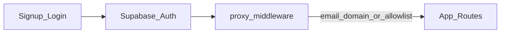

# ベータ開放チェックリスト

**ゴール**: 信頼できる少数〜数十人規模が、**招待または許可リスト**で利用開始でき、フィードバックと障害対応が回る状態。

## 現状の前提（コードベース）

- **利用者制限**: [`src/proxy.ts`](../../src/proxy.ts) でログイン後メールが `@civictech.tv` でないユーザーは `signOut` し、[`src/app/login/page.tsx`](../../src/app/login/page.tsx) に専用エラーメッセージがある。**ベータ／一般開放の最優先はこのゲートの設計変更**。
- **認証 UI**: メール／パスワードと Google OAuth は既に [`signup`](../../src/app/signup/page.tsx) / [`login`](../../src/app/login/page.tsx) にある。実際に誰が入れるかは **Supabase 側のプロバイダ設定** と **アプリ側の追加チェック** の組み合わせ。
- **データ削除**: `auth.users` 削除時にユーザー行は `ON DELETE CASCADE`（[`supabase/migrations/20260211120000_baseline.sql`](../../supabase/migrations/20260211120000_baseline.sql)）。**アプリから Auth ユーザーを削除するフローは別途 GA 向けに [general-availability-checklist.md](general-availability-checklist.md) を参照**。
- **エクスポート**: 設定から全データ JSON ダウンロードあり（[`TodayClient.tsx`](../../src/app/today/TodayClient.tsx) 設定ドロワー）。持ち出しは可能だが「アカウント削除」とは別。
- **共有キャッシュ**: `shared_products` の RLS は認証ユーザーがキャッシュ書き込み可能。利用者増に伴う論点は [general-availability-checklist.md](general-availability-checklist.md) と [Issue #2](https://github.com/kzkski/ketolog/issues/2)。

## 1. アクセス制御（実装）

| 項目 | 内容 |
|------|------|
| **ドメイン固定の撤廃／一般化** | `civictech.tv` ハードコードをやめ、`ALLOWED_EMAIL_DOMAINS` 等の **環境変数**、**許可メールリスト**、**`beta_users` テーブル + メール照合** などに置き換える。 |
| **ベータ専用モード** | 例: `BETA_MODE=true` のときだけ追加チェック、GA 時はオフで全通し、のように **デプロイ単位で切り替え**できると運用しやすい。 |
| **招待コード**（任意） | コード入力 → Server Action / Edge で検証。**実装コストとコード流出リスクのトレードオフ**あり。 |

## 2. 登録・認証（実装＋ Supabase ダッシュボード）

- **Redirect URL**: 本番 URL を Supabase Auth（Google 含む）の許可リストに登録。
- **メール確認**: ベータでは「確認メール必須」にするとスパム登録が減りやすい。
- **ログイン画面文言**: 「civictech 専用」から **ベータ参加者向け説明**へ差し替え（[`login/page.tsx`](../../src/app/login/page.tsx)）。

## 3. 法務・同意（実装の最低ライン）

- **ベータ利用規約／プライバシー（簡易版）** の静的ページと、サインアップまたは初回利用前の **同意**（記録するなら `user_settings` 拡張や Auth metadata を検討）。
- 文言は法務レビュー前提でよいが、**URL と画面導線は実装タスク**。

## 4. 運用・観測

- **エラー・パフォーマンス**: Vercel のログ、必要なら Sentry 等（任意）。
- **ヘルスチェック**: `GET /api/health` でアプリ生存 + Supabase 疎通（`shared_products` への **`GET` で主キー `barcode` を 1 件だけ取得する軽量クエリ**。同テーブルに `id` 列はない。PostgREST の `HEAD` は環境によって失敗しうるため使わない）を返せるようにする。`200` は `{ ok: true, checks: { app: \"ok\", supabase: \"ok\" }, db_latency_ms, timestamp }`、失敗時は `503` と `error`（`supabase_unavailable` / `healthcheck_misconfigured`）を返し、Sentry へ送信する。`supabase_unavailable` のときは切り分け用に `diagnostic`（PostgREST の `code` / `message` 相当）を付ける場合がある。Vercel サーバーレスでは Sentry 送信後に `flush` する。
- **Vercel Cron（本番の定期ヘルス）**: リポジトリ直下の [`vercel.json`](../../vercel.json) で **`/api/health` を 5 分間隔（cron: `*/5 * * * *`、時刻は UTC）** で叩く。プレビュー環境では Cron は作成されない（Vercel の仕様）。**Hobby プランでは日次より短い間隔の Cron がデプロイ不可**のため、5 分間隔を使う本番は **Pro 相当以上** を前提とする（[Cron Jobs – Usage & Pricing](https://vercel.com/docs/cron-jobs/usage-and-pricing) を都度確認）。
- **監視間隔・失敗判定（運用方針）**:
  - **間隔**: 上記どおり **5 分**を初期値とする（負荷と検知速度のバランス）。変更する場合は `vercel.json` の `schedule` と本項を合わせて更新する。
  - **単発失敗**: 一時的なネットワーク揺らぎ等で `503` が出うるため、**単回の失敗だけでは即インシデントとみなさない**。
  - **連続失敗**: **2 回連続**（約 10 分間隔で 2 度 `503` / Sentry の同一系統エラーが続く等）を **障害疑いの目安**とする。通知チャネル（Slack 等）は別 Issue で接続する想定で、Sentry 側は **期間内件数・連続性に基づくアラートルール**の設定を推奨する。
- **Cron 失敗と Sentry の確認手順（開発・検証）**: プレビューでは Cron が動かないため、**ローカルまたは一時環境**で `SUPABASE_SERVICE_ROLE_KEY` を外す・誤った値にする等、意図的に `503` となる状態で `GET /api/health` を実行し、Sentry に `route: /api/health` 付きのイベントが積まれることを確認する。本番ではデプロイ後に Vercel ダッシュボードの **Cron Jobs / 実行履歴**で定期実行を確認する。
- **問い合わせ先**: フッターや設定に **連絡メールまたはフォーム URL**。
- **バージョン・変更履歴**: `NEXT_PUBLIC_CHANGELOG_URL`（[README.md](../../README.md)）。ベータ向けに「既知の制限」を短く書くと期待値調整に有効。

## 5. 外部サービス（Open Food Facts）

継続運用は [third-party-compliance.md](third-party-compliance.md)。バーコード機能をベータで使う場合も同ドキュメントに従う。

## 6. プロダクト完成度

[ROADMAP.md](../../ROADMAP.md) の Phase 2-2（バーコード等）と README の機能一覧の表記差は主催者判断。**最低限**: 既存フローのクリティカルな不具合の解消と、モバイル主要画面の確認（[README.md](../../README.md) のモバイル手順）。

## 7. CI の最低ライン（推奨）

[quality-and-ci.md](quality-and-ci.md) を参照。**PR 時に `npm run lint` と `npm run build`** を載せると、デプロイ前の破壊検知に効く。

## 8. 検証仮説・観測指標（参考）

[docs/research/](../research/README.md) の市場調査で整理された、ベータ期に**検証しうる論点**のメモ。**リリースゲートの必須条件ではない**。計測基盤が未整備のときは定性・手動集計からでよい。

| 優先度 | 仮説の骨子 | 観測・指標の例 |
|--------|------------|----------------|
| 高 | PWA でウェアラブル非連携でも、コアユーザーが週次で記録を継続できる | Day 7 / Day 30 リテンション、記録完了までの負荷（定性含む） |
| 高 | コンビニ・外食プリセットや JSON インポートがオンボーディングと継続に効く | 初回24時間以内のプリセット／インポート率、利用群の継続比較（可能なら） |
| 中 | 汎用カロリーアプリ利用者が「ケト向け記録」として価値を感じる | インタビュー／アンケートでの不満・価値の定性 |
| 中 | JSON エクスポートがコーチ・仲間とのデータ交換に使われる | エクスポート頻度、用途のヒアリング |
| 低（将来） | 分析・Ketovisor 連携など下流機能への支払意思 | コンセプトテスト、WTP（任意） |

## フェーズ横断（ベータ前後で進めてよいこと）

- 新設する `ALLOWED_*` や `BETA_MODE` を [`.env.example`](../../.env.example) と README に追記。
- ROADMAP と README の Phase 2-2 表現の整合（[CONTRIBUTING.md](../../CONTRIBUTING.md) に従う）。

## 実装優先度（ベータ周りの目安）

1. **§1 + §2**（ゲート緩和と Supabase 本番設定）
2. **§3 + §4**（同意・連絡先・ログ）
3. **§7**（CI に lint/build）— [quality-and-ci.md](quality-and-ci.md)
4. **§5**（OFF 継続義務）

## 判断が分かれそうな点

ベータの「限定」を **メールドメイン**で切るか、**招待コード**か、**手動で許可リストに載せてからサインアップ**かで実装量と運用負荷が変わる。
